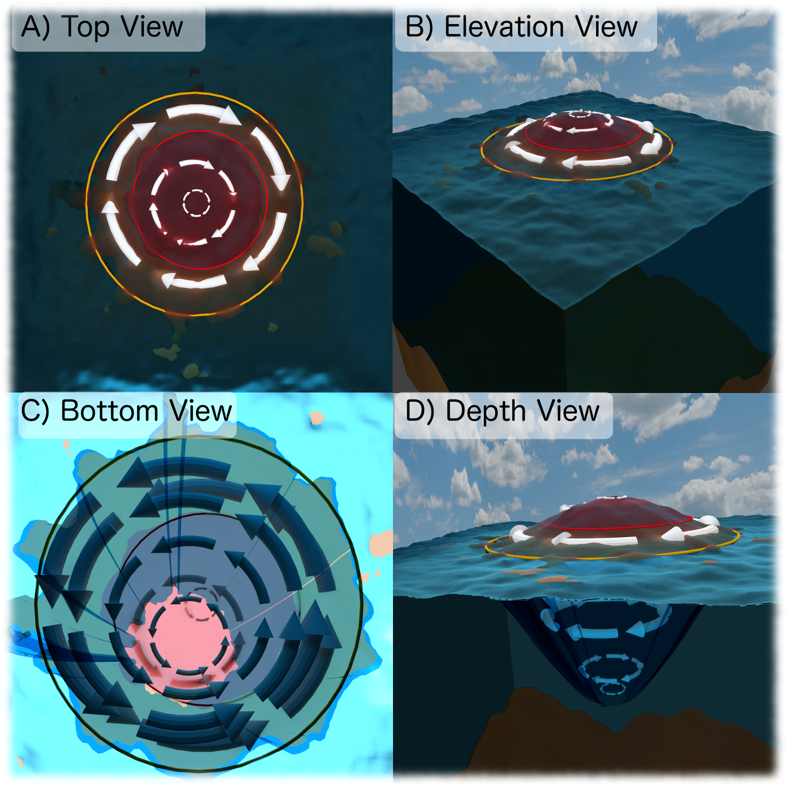

==========
Background
==========

The first complication over the understanding of eddy's energy is the lack of strict definition of an eddy. The second problem is the complexity of all the processes who interact with these transient features. Finally, the definition of EKE does not differentiate between eddies, jets and background, where each of this process corresponds to a different reservoir of energy. In order to understand the ubiquity of eddies, their complexity and the mixture of energy reservoirs, the present section explore the background of eddy tracking algorithms and the mathematical definition of KE.

Eddy tracking
-------------

Mesoscale turbulence now is possible using Earth-orbiting satellite data and numerical simulations. Due to the necessity to understand the impact of the eddies in the ocean and Earth's climate, autonomous methods were needed to extract mesoscale features. Since the 70's the study of ocean eddies mainly used satellite data of ocean colour and sea surface temperature. However, recently the sea level anomaly provided a more related field with the ocean eddy field than previous datasets. Eddies are classified based on their rotational direction as cyclonic if they rotate counter-clockwise (in the Northern Hemisphere) or anti-cyclonic otherwise [Figure 1]. Cyclonic eddies produce a negative perturbation in SLA and elevations in subsurface density surfaces. Anti-cyclonic eddies, cause a positive perturbation in SLA and depressions in the subsurface density surfaces. These characteristics have been used in the identification of ocean eddies in SLA, where closed-contours represent the definition of an eddy.

   Figure 1. Representation of an anti-cyclonic eddy (Northern hemisphere) and its velocities over the SLA field.

One of the first automated eddy detection algorithms used physical criteria and relied on a measure of rotation and deformation known as Okubo-Weiss (:math:`W`) parameter [2]:

.. math::
   W = \underbrace{\left(\frac{\partial u}{\partial x} - \frac{\partial v}{\partial y}\right)^2}_{\text{Normal component of strain}} + \underbrace{\left(\frac{\partial v}{\partial x} + \frac{\partial u}{\partial y}\right)^2}_{\text{Shear component of strain}} - \underbrace{\left(\frac{\partial v}{\partial x} - \frac{\partial u}{\partial y}\right)^2}_{\text{Relative Vorticity}}
..

The eddies were defined as features where the :math:`W`-parameter was below an expert-specified negative threshold. This parameter was typically applied in a region, where a specific threshold was defined. Chelton *et. al.*, 2007 presented the first global observational eddy tracking study based on the :math:`W`-parameter, using a global uniform threshold [3]. Some years later, Petersen *et. al.*, 2012 analysed a 3D regional model using the :math:`W`-parameter in addition of a constraint on the shape of the eddies [4].

However, the :math:`W`-parameter approach has been criticized for its dependence on thresholds and sensitivity to noise.  As a result, later research efforts developed new methods as wavelet analysis, winding angle, reversal of the flow field, perturbation of the sea surface temperature (SST), the outermost closed SLA anomaly contours, or a combination of physical and geometric methods. All these methods try to alleviate the threshold dependent, however, they depend on expert-defined parameters to determine what constitutes an eddy.

While the algorithm may be different, SLA methods follow a similar workflow, which could include pre- and post-processing steps (temporal and spatial filters). Everything starts with a single snapshot of SLA (satellite or model), where these methods isolate the potential eddies. Notice that a three-dimensional study using surface information is not appropriated cause that data is noisy and contains multiple processes other than eddies. Is important to point out, that the criteria that define an eddy changes from study to study but generally involve and strict expert-defined criteria such as minimal size or shape. This process is repeated each timestep of the dataset, then the eddy structure and trajectories are constructed by associating features in the time :math:`n-1` to the nearest and most similar feature in :math:`n`. Finally, some studies filter their results to only include eddies that persist a specific window of time (often several weeks or months).

This track eddy algorithm has three main steps. First, identify eddy like features using the closed-contours in SLA or other physic parameters that could have multiple extremums. Second, adjust an two dimension gaussian to remove the background and any other noise contained by the signal. Third, we track each feature in time by associating a feature in on time-step to the nearest feature in the subsequent one.

Kinetic Energy
--------------

Energetics analysis has been used to understand the oceanic variability [REFERENCES]. The total kinetic energy (:math:`KE`) has been decomposed into the mean flow and a time-varying flow. This approximation follows the perturbation theory, where the velocity field is split into a mean and the perturbation, or difference between the original field and the mean. This decomposition contains crossed terms, which contain information of both flows. However, the residual term vanishes when it is averaged over the same time-mean period used in the velocity decomposition. This :math:`KE` decomposition is referred as an orthogonal decomposition, resulting on two :math:`KE` components commonly known as the Mean Kinetic Energy (:math:`MKE`) and the Eddy Kinetic Energy (:math:`EKE`). 

