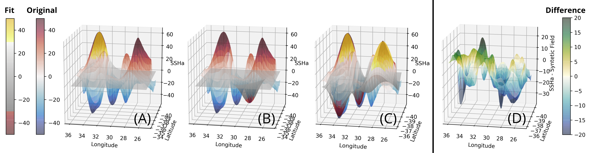

=======
Methods
=======

Eddy Identification
-------------------

The eddy identification algorithm starts with the simple idea that every eddy contour should be an ellipse. Which may contain multiple extreme values due to the merging or formation of eddies. 
It's necessary to point out that cyclonic eddies are surrounded by a negative closed-contour SLA, while anticyclonic eddies are surrounded by a positive closed-contour SLA. Both polarities possess a specific phase angle between the velocity components.

To determine the outermost contour of the eddy, starting from a extreme value (i.e. 200 cm or 2 m, depending on the dataset units), the algorithm searches for the largest possible contour that would allow the feature to not violate the assumption that an eddy has an ellipse shape and a Gaussian fitting inside the closed contour. In the final version of the algorithm will be possible to reconstruct the eddy's 3D structure. Currently, the algorithm allows to reconstruct the surface of the eddy using a 2D Gaussian fitting, which allows the remotion of the background signal.

Figure 1 shows how the algorithm works for an idealized Gaussian. The algorithm separates cyclonic and anticyclonic eddies, in fact, it's possible to analyse only cyclonic or anticyclonic eddies. For a given extreme contour value, starting at that SLA value, a threshold value is gradually increased in the contour level (Default value = 1 cm), however, Faghmous, J. *et. al.* showed that a finer threshold step leads to more accurate eddy sizes and amplitudes [4]. This threshold step size does affect the algorithm's wall time, however, the algorithm is really parallelizable. This allows to use fine threshold steps with reasonable compute time for a global dataset.

.. figure:: ../images/algorithm_work_FV.png
   :scale: 50 %
   :alt: Alt content 

   Figure 1. SHOW IN IDEALIZED GAUSSIANS..

.. warning::
   The phase angle will be implemented in the Beta 0.2 release.
..

.. warning::
   The eddy's 3D structure will be implemented in the V.1 release.
..

This eddy identification algorithm have the next parameters considerations:

- The eddy area (:math:`A_{eddy}`) should be smaller than an square with length side of two Rossby Radius:

.. math::
   A_{eddy} \leq 2\left(\frac{(gD)^\frac{1}{2}}{f}\right)^2

- The ellipsoid fitting (:math:`\epsilon`) interval should be between:

.. math::
   0.65 \geq \epsilon < 1

Values around :math:`1` represent a exact fitness and the minimum value acepted should be higher than :math:`0.65`.   

.. figure:: ../images/algorithm_work_FV.png
   :scale: 50 %
   :alt: Ellipse criteria for eddy identification in the trackeddy algorithm 

   Figure 2. First step where eddies are discarded when the ellipse fitness is less than 0.65  (Blue-dotted line shows the ellipsoid fitted and the red line shows the closed contour). The data correspond to a numerical simulation of the Southern Ocean.

- The eccentricity (:math:`e`) interval should be between:

.. math::
   0 > e < 0.85

Values arround :math:`1` represent a circle and 0 represent a line. However, the minimum value setup as 0.85 represents a proportion of :math:`\frac{b}{2a}`. 

- The gaussian fitting (:math:`\psi`) interval should be between:

.. math::
   0.65 > \psi < 1

Values around :math:`1` represent a exact fitness and the minimum value acepted should be higher than :math:`0.65`.

.. figure:: ../images/gaussian_fitness.png
   :scale: 100 %
   :alt: Gaussian shape in the ellipe mayor axis for more than 500 eddies. 

   Figure 3. Average over more than 500 eddies. The Gaussian fitness over the average is slightly better than the parabolic fit.

- Optionally, an additional 2D Gaussian can be fitted. 

   Figure 4. Gaussian fitting in two dimensions to recreate the eddy field. (A) Anti-cyclonic eddy. (B) Cyclonic eddy. (C) Syntetic eddy field. (D) Difference between the original field and the syntetic field [cm]. 
   
- Finally, an phase angle analysis will be implemented in adition to a machine learning algorithm [5]. 

These parameters constrain the eddy identification, however, the condition only depends on the fitting of an idealized Gaussian to each eddy. This allows to extract and reconstruct with indirect methods the eddy field. No other parameter are imposed so just the eddies without this gaussian and ellipsoid features are discarded.

Eddy Time Tracking
------------------
All the transient features are identified in each SLA snapshot, following the eddy identification algorithm, a time tracking is applied: For each eddy feature identified at time :math:`t`, the features at time :math:`t+1` are searched to find an eddy feature inside the close contour or the closest feature within the distance an eddy can displace between two sucessive time frames. This constrain uses the phase speed of a baroclinic Rossby wave, calculated from the Rossby radius of deformation as presented in Celton *et. al.* [4] and a 180 degree window search using the last peferential direction where the eddy was propagating.

.. warning::
   The 180 degree window and closest feature within the baroclinic Rossby wave speed will be implemented for the next release.
..

Once a feature at time :math:`t` is associated with another feature at time :math:`t+1` their amplitude and area is compared. However, this comparison doesn't avoid the association of eddies cause the nature and purpose of this tracking algorithm. 

When global model data is used, the eddies continuity on time is not significative affected, therefore the eddies do not disappear as often as in satellite data (AVISO products). Nonetheless, this tracking algorithm contain an automatic procedure, which allows feature to be reassociated using an user-defined number of time-steps as threshold before terminating the track (This is also related with the traveled distance by the eddy).   

Kinetic Energy
--------------

In many parts of the ocean, transient processes contain more kinetic energy (commonly known as eddy kinetic energy, or :math:`EKE`) than the men kinetic energy (:math:`MKE`). Variations in the oceanic energy balance can be diagnosed through :math:`EKE`, which allows the analysis  of positive or negative feedbacks on climate change. However, one difficulty in determining the role of eddies in the ocean transient adjustment to climate change is the lack of a process-based definition of :math:`EKE`. 

The aim of this algorithm is to decompose and analyse :math:`EKE` according to different ocean processes. Specifically, the separation of kinetic energy will be recustructed using a 2D gaussian fitting for each closedd eddy detected (:math:`EKE_{eddy}`) from the eddy kinetic energy due to meandering jets (:math:`EKE_{jets}`) and the background eddy kinetic energy (:math:`EKE_{background}`):

.. math::
   EKE = EKE_{eddy} + \underbrace{EKE_{jets} + EKE_{background}}_{EKE_{residual}}
..

However, this decomposition represents several challenges like:

- Second order terms which maybe important in the energy balance.

.. math::
   KE = MKE + EKE 
..

Expanding this equation we obtain:

.. math::
   KE = MKE + EKE_{eddy} + \underbrace{EKE_{jets} + EKE_{background}}_{EKE_{residual}} + EKE'_{O^1}
..

Replacing the kinetic energy definition:

.. math::
   \hspace{-3cm}\frac{1}{2}\rho_0 (u^2+v^2) = \frac{1}{2}\rho_0 (\bar{u}^2 + \bar{v}^2) + \frac{1}{2}\rho_0 (u_{eddy}^2 + v_{eddy}^2) +
..

.. math::
   \hspace{2.7cm}\frac{1}{2}\rho_0 (u_{jets}^2 + v_{jets}^2) + \frac{1}{2}\rho_0 (u_{background}^2 + v_{background}^2) +
..

.. math::
   \hspace{0.6cm}\rho_0 (\bar{u}u_{eddy} + \bar{v}v_{eddy}) + \rho_0 (\bar{u}u_{jets} + \bar{v}v_{jets}) + 
..

.. math::
   \hspace{4cm}\rho_0 (\bar{u}u_{background} + \bar{v}v_{background}) + \rho_0 (u_{eddy}u_{jets} + v_{eddy}v_{jets}) + 
..

.. math::
   \hspace{0cm} \rho_0 (u_{eddy}u_{background} + v_{eddy}v_{background}) + 
..

.. math::
   \hspace{-0.6cm} \rho_0 (u_{jets}u_{background} + v_{jets}v_{background})
..

where :math:`u = \bar{u} + u_{eddy} + u_{jet} + u_{background}`. Assuming :math:`\iff` :math:`\bar{EKE'_{O^1}} \rightarrow 0` :math:`\implies` we can ingore those terms. However, this implications is really hard to prove unless we define an exact way to extract the velocity field for each eddy.   

Because of this, the first aproach to this problem will be the 

