=======
Methods
=======

The "Trackeddy'' algorithm has been developed to estimate
Kinetic Energy in transient eddies or Transient Eddy Kinetic Energy (TEKE).
This autonomous eddy identification, tracking and reconstruction algorithm
assumes eddies can be approximated as Gaussians in transient fields, such as sea
surface height. This estimation is done through the identification of eddies,
then the optimal Gaussian fitting to each individual eddy, followed by the
reconstruction of the transient field and finally the calculation of KE from
the reconstructed field. The following sections will present the algorithm
structure, criteria, user-specified values (Default user-specified were
defined based on a repetitive Southern Ocean Simulation (ACCESS-OM2) and the
AVISO+ satellite dataset).

This algorithm has two main components: logical and data
management. The logical component is a set of logical and
mathematical operations, while the data management manipulates python
dictionaries to create databases. The logical is responsible for the
eddy identification and the generation of a python dictionary containing all
the information of each feature classified as an eddy
(referred bellow as Identification). While the data management modifies the eddy
dictionary to replace or add identified eddies at different contour slices of
the field (Eddy Replacement)
or create a new dictionary where eddies are correlated on time (Time Tracking).

:numref:`trackflow` shows the "trackeddy'' flowchart, composed by 3 modules; the
eddy identification, contour replacement and time tracking. Each one of them is
structured in three sections: input, main algorithm and output. Further
information of each individual algorithm will be explained in the following
sections of this documentation.

.. _trackflow:

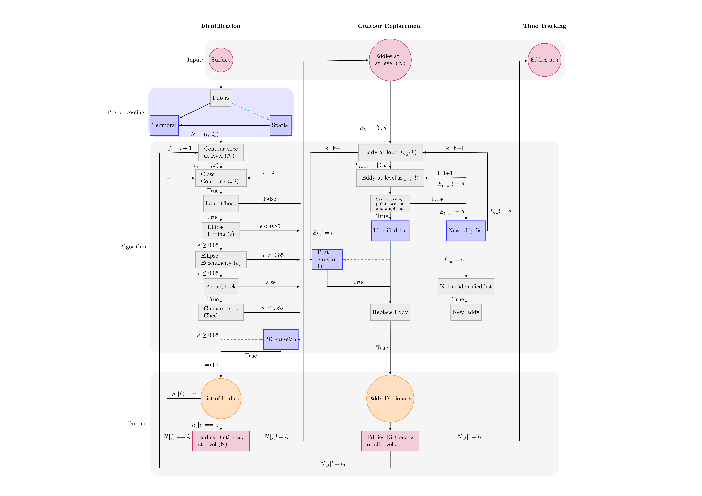

  Trackeddy flowchart detailing the structure, modularity and steps the algorithm
  follows. Black lines are minimum required steps to identify eddies and blue
  dotted lines are optional implementations.

For a detailed-code description, refer to `how_it_works.ipynb
<https://github.com/Josue-Martinez-Moreno/trackeddy/blob/master/
examples/how_it_works.ipynb>`_

Input Data
----------

TrackEddy's input must be a field with Gaussian-like perturbations.
Some examples of this type of fields are the geostrophic stream-functions:

  - Sea Surface Height (SSH)
  - Sea Surface Height Anomaly (SSHa)
  - Dynamic Height (Isobaric surface)
  - Specific Volume Anomaly Surface (Montgomery)
  - Potential Density Surface or Neutral Surfaces (Cunningham)
  - Isopycnals (Neutral Density Surface, Potential Density, or Omega Surface)
  - Pressure Surface

The algorithm has been implemented in a variety of fields. Here we present
some capabilities of TrackEddy:

  + Random Gaussian fields test:
    To test the capabilities of the TrackEddy time-tracking algorithm
    an idealised perturbation field was generated. It consist on a number of
    Gaussians which moves stochastically or commonly known as random walkers
    (random initial conditions and time evolution).
    Each Gaussian perturbation starts at location (x,y) and at each
    time step it moves +1 or -1 in the x and y axis with equal probability.
    Then TrackEddy was implemented to verify the capabilities of the tracking
    and reconstruction of the field. :numref:`randomgauss` shows the
    tracking of each individual Gaussian as it moves as a random walker. For
    additional information of this example, refer to `random_walkers.ipynb
    <https://github.com/Josue-Martinez-Moreno/trackeddy/blob/master/
    examples/random_walkers.ipynb>`_.

    .. _randomgauss:
    .. figure:: ../images/random_gaussian_field.gif
      :align: center
      :scale: 100 %
      :alt: Alt content

      Random Gaussian walkers tracked by the Trackeddy Algorithm. Black
      lines represent the time tracking of each feature and the green star
      corresponds to their initial position.

  + Sea Surface Height anomaly:
    TrackEddy has been fully implemented on sea surface height
    from satellite observations (Aviso+) and global numerical
    simulations (ACCESS-OM2). The preprocessing of the data included the
    subtraction of the time-mean during the period 1993-2010 and an
    uniform spatial filter which removes all non-mesoscale features.
    Then each of the mesoscale sea surface height anomaly field was analysed.
    :numref:`eddyidentif` shows the location of each identified eddy
    (:math:`n \sim 2401`) from the satellite Aviso+ dataset during the
    1st of January 1993. :numref:`eddyidentif_model` shows the trajectory of the
    identified eddies from the ACCESS-OM2 simulation with life-spams longer than
    3 weeks for 1993 (:math:`n \sim ????`).

    .. _eddyidentif:
    .. figure:: ../images/eddy_identified.png
      :align: center
      :scale: 40 %
      :alt: Alt content

      Satellite SSHa snapshot and location of identified eddies from 1st of
      January 1993. Magenta stars show the location of positive eddies and
      green stars the location of negative eddies.

    .. _eddyidentif_model:
    .. figure:: ../images/eddy_identified_model.png
      :align: center
      :scale: 40 %
      :alt: Alt content

      Trajectory of identified eddies with life-spams longer than 3 weeks. Red
      dots corresponds to the initial location and green triangles correspond to
      the last location.

Currently, the algorithm is focused on methods to estimate TEKE from SSH and
SSHa fields and it has been tested at identifying,
and reconstructing the Transient Eddy Field from the `GLOBAL OCEAN GRIDDED
L4 SEA SURFACE HEIGHTS AND DERIVED VARIABLES REPROCESSED (1993-ONGOING)
<http://marine.copernicus.eu/services-portfolio/access-to-products/
?option=com_csw&view=details&product_id=SEALEVEL_GLO_PHY_L4_REP_OBSERVATIONS_008_047>`_
and a global climate simulation (`ACCESS - OM2
<http://cosima.org.au/index.php/models/access-om2-01-2/>`_). Further analysis
will be added to this documentation at the results chapter.

.. warning::
   The current version has been tested with SSH, SSHa and pressure fields.
..

Eddy Identification Criteria
----------------------------

The first step in the procedure is to identify eddies, TrackEddy does this by
assuming that the outermost contour of any eddy can be fitted by an ellipse
(`A. Fernandes and S. Nascimento,
(2006) <https://link.springer.com/chapter/10.1007%2F11893318_11>`_).
Furthermore, for mesoscale features, the default area contained by the
eddy contour should be smaller than :math:`2 \pi L_r^2`, where :math:`L_r`
is the first-baroclinic Rossby radius of deformation
(`Klocker, A., & Abernathey, R. (2014)
<https://journals.ametsoc.org/doi/abs/10.1175/JPO-D-13-0159.1>`_).
These premises allow the identification and tracking of eddies with multiple
local extreme values while they merge and/or interact with other features.
Finally, to avoid mismatches with western boundary, jets and land perturbations,
the field profile over the minor and major axis of the fitted ellipse
should adjust to a Gaussian and also eddies should not be surrounded land.

.. Optionally, a 2D Gaussian fit can be implemented to reconstruct the field only
.. to the identified eddies.

.. important::
  The eddy fit, eccentricity, area scale and Gaussian fit can be modified
  by the user. For more information refer to the following subsections.
..

Filters
"""""""
To optimise the perturbation field and remove biases, the code supports the
substraction of temporal and spatial filters. The temporal filter removes the time
averages and the spatial filter removes the spatial average for each time-step
of the dataset. The function argument should look::

  filter={'time':{'type':None,'t':None,'t0':None},
        'spatial':{'type':None,'window':None,'mode':None}}

.. important::
  By default, the algorithm will not apply any filter.
..

Temporal
''''''''
TrackEddy supports three temporal filters: orthogonal, historical \
(Non-orthogonal), and moving-average (`Kang, D., & Curchitser, E. (2017),
(2006) <https://journals.ametsoc.org/doi/full/10.1175/JPO-D-17-0063.1>`_):

- Orthogonal filter removes the mean value of the field each time
  step :math:`(T = T0)`. Function argument::

    filter={'time':{'type':'orthogonal','t':0,'t0':10,'value':None},
            'spatial':{'type':None,'window':None,'mode':None}}

- Historical filter remove the trend over a specific period of days,
  time-step or historical at each time step :math:`(T\ !=\ T0)`. Function argument::

    filter={'time':{'type':'historical','t':None,'t0':shape(data)[0],
            'value':None},'spatial':{'type':None,'window':None,'mode':None}}

  or removes the user-defined historical value. Function argument::

    data=mean_field[:,:]
    filter={'time':{'type':'historical','t':None,'t0':None,'value':data},
            'spatial':{'type':None,'window':None,'mode':None}}

- Moving average filter removes the mean value over a period of time defined
  at each time step :math:`(T=T_0)`. Function argument::

    filter={'time':{'type':'moving','t':-10,'t0':10,'value':None},
            'spatial':{'type':None,'window':None,'mode':None}}

.. warning::
   In case of system memory errors, it's recommended to input the
   preprocessed data using the historical temporal filter.
..

Spatial (Optional)
''''''''''''''''''
TrackEddy supports three spatial filters: meridional, zonal, and moving-average:

- Meridional filter removes the meridional or x-axis average of the field::

    filter={'time':{'type':None,'t':None,'t0':None},
            'spatial':{'type':'meridional','window':None,'mode':None}}

.. figure:: ../images/meridional_filter.png
  :align: center
  :scale: 100 %
  :alt: Meridional Filter

- Zonal filter removes the zonal or y-axis average of the field::

    filter={'time':{'type':None,'t':None,'t0':None},
            'spatial':{'type':'zonal','window':None,'mode':None}}

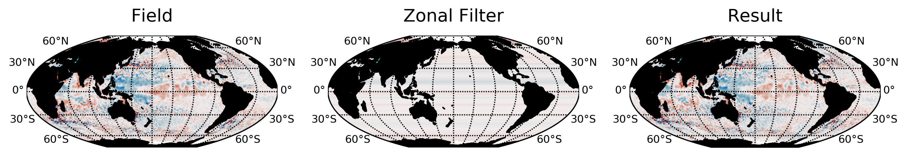

- Moving average filter removes the mean value over a moving square matrix
  of order :math:`n`, it can use a multidimensional uniform filter or a
  multidimensional Gaussian filter.::

    n=50 # Sizes of the uniform filter given for each axis as a sequence.
    filter={'time':{'type':None,'t':None,'t0':None},
            'spatial':{'type':'moving','window':n,'mode':'uniform'}}

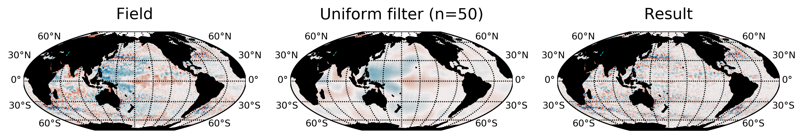

Level Analysis
""""""""""""""
TrackEddy analyses eddies at discrete levels :math:`n` in the data field.
For each level :math:`N_{(1:n)}` defined by the user, the algorithm will
extract the list of contour paths (:math:`l_c`). For example,
:numref:`contourslice` shows the contour paths for several levels.

.. _contourslice:

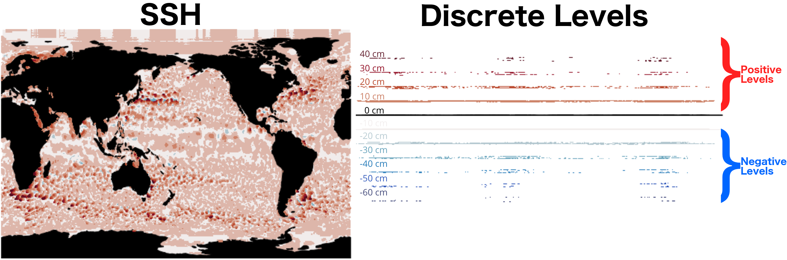

  Example of discrete levels analysed by TrackEddy. Left panel shows
  a snapshot of SSHa (AVISO+) and right panel presents an example of positive
  and negative discrete levels. For each level, TrackEddy
  will extract the closed contour paths.

.. As TrackEddy has the capability to replace the closed contour with the
.. outermost and best fitted closed contour, i

For example, when TrackEddy is implemented in a perturbation field, it is
recommended to the user to define the levels as a positive or negative extreme
value and then approximate to 0. For example, in SSHa TrackEddy identifies
eddies as positive or warm cores and negative or cold cores. Consequently,
positive or warm cores will contain cyclonic eddies in the Northern Hemisphere,
and anti-cyclonic eddies in the Southern Hemisphere. The opposite
case will happen for the negative or cold cores. The differentiation
between cyclonic and anticyclonic can be done during post-processing or
at the Eddy Contour Replacement algorithm.

This algorithm is designed to cycle through :math:`N_{(1:n)}` levels
(:numref:`ident_scheme`), which are defined as a dictionary containing the
maximum value, minimum value and steps::

  levels={'max':100,'min':1,'step':1}

or it can also be defined as a list containing the levels, allowing
the user to define an irregular grid on the level space to increase
the steps while approximating to 0, for example, half-life decay :math:`a/2^n`::

  a=array([ii for ii in arange(10)*0+100])
  n=array([ii for ii in arange(10)])
  levels=a/(2**n)
  print(levels)
  #array([ 100. ,50. ,25. ,12.5 ,6.25 ,3.125 ,
  #        1.5625 ,0.78125 ,0.390625 ,0.1953125])

This option improves the walltime while analysing
big datasets and better identifies small perturbations.

.. important ::
  TrackEddy do not support a zero level contour due to issues with the contour
  extraction.
..

Closed Contours
"""""""""""""""

On each contour slice :math:`N`, the algorithm checks if the contour paths are
closed. Closed contours (:math:`n_c`) are defined as the contours where
the initial coordinate of the contour path is the same as the end of the
contour path (:numref:`satelliteclosecontour`).

.. _satelliteclosecontour:
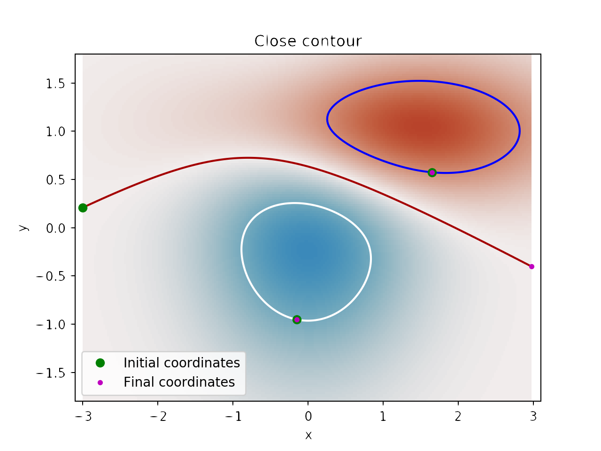

  Example of open and closed contours. Green and magenta dots correspond to the
  initial and final coordinates respectively of the contour. Therefore, blue
  and white contour are closed, while red is open.

:numref:`closecontour` shows the closed contours detected from
satellite data at two levels.

.. _closecontour:
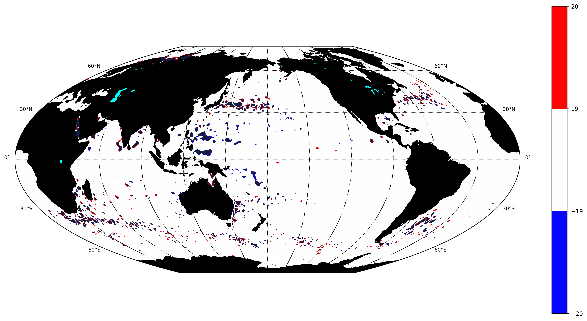

  Closed contours detected at 29 cm (red) and -29 cm (blue) from AVISO+ SSHa
  satellite dataset.

Land Check
""""""""""

If the contour is closed, then the contour is first tested to determinate if
it is surrounding land. To accept the closed half of the total of contour points
(:math:`n_g`) should not be surrounded by land (:math:`n_i`):

.. math::
  \frac{n_g}{n_i}>2
..

Otherwise, the closed contour is discarded (:numref:`landcheck`).

.. _landcheck:
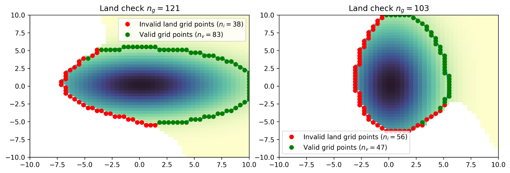

   Example of contours surrounded by land. green dots correspond to
   valid grid points and red to invalid grid points over land. The left panel
   shows an accepted contour, as the number of invalid points is smaller than
   the total of contour points, while the right panel shows a discarded contour,
   due to the number of invalid points is bigger than half of the total contour
   points.

.. note::
  The land check only works if the input data is masked or if it contain nan
  values.
..

Ellipse Fitting
"""""""""""""""
The next task is to determine which closed contours have a coherent shape
as an eddy. Therefore, TrackEddy fits an optimal ellipse to
each closed contour (Fernandes (2006)) (:numref:`fitellipse`).
The fit-estimation optimises the ellipse using the Least
Squares method. The estimator is extracted from the following
equation (For more information: `fit_ellipse
<https://www.mathworks.com/matlabcentral/fileexchange/3215-fit-ellipse?
requestedDomain=www.mathworks.com>`_):

.. math::
  G(x,y;A) = ax^2 + bxy + cy^2 + dx + ey + f
..

where :math:`A` is the vector of parameters to be estimated
:math:`(a,b,c,d,e,f)` and :math:`x`, :math:`y` are the coordinates.

.. _fitellipse:
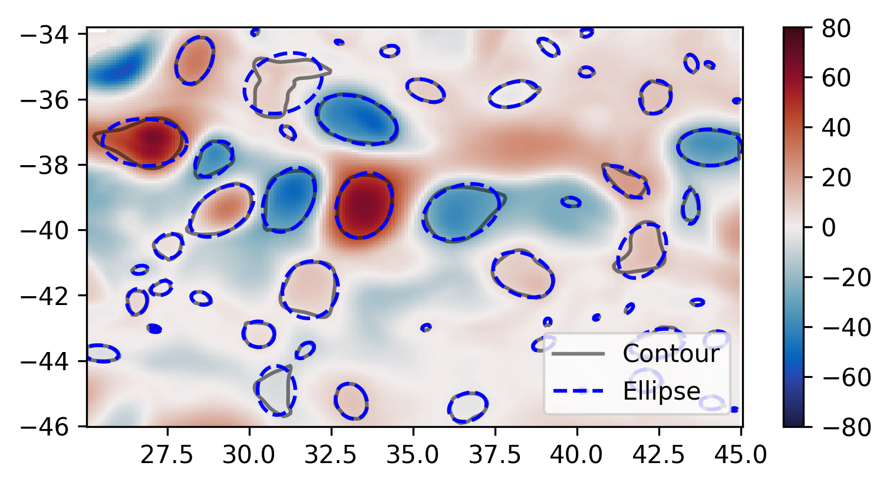

   Example of identified closed contours and their corresponding optimal
   fitted ellipse.

Potential eddies are determined based on ellipse determination coefficient
(:math:`R_\epsilon`). First, TrackEddy resolves the matrix coefficient of
determination:

.. math::
  R_\epsilon^2 =1 - \frac{SSR}{TSS}
..

where :math:`SSR` is the sum of squared residuals:

.. math::
  SSR = \sum_{i=0}^n(y_i - f(x_i))^2
..

and TSS is the total sum of squares of the model:

.. math::
  TSS = \sum_{i=1}^n (y_i-\bar{y})^2 .
..

The coefficient of determination need to be within the user defined threshold,
the default threshold is:

.. math::
   0.85 < R_\epsilon^2 \leq 1

Additionally, TrackEddy projects the ellipse into one dimension and
calculates the coefficient of determination between the contour and the
fitted ellipse (:numref:`flatelipse`) which should be also within the user
defined interval. If any of the coefficients of determination is
outside the threshold, then the closed contour is discarded: otherwise,
the algorithm proceeds to the next step.

.. note::
  The algorithm uses both determination coefficients to ensure
  a proper fit and prevent any misrepresentations of the ellipse.

.. _flatelipse:
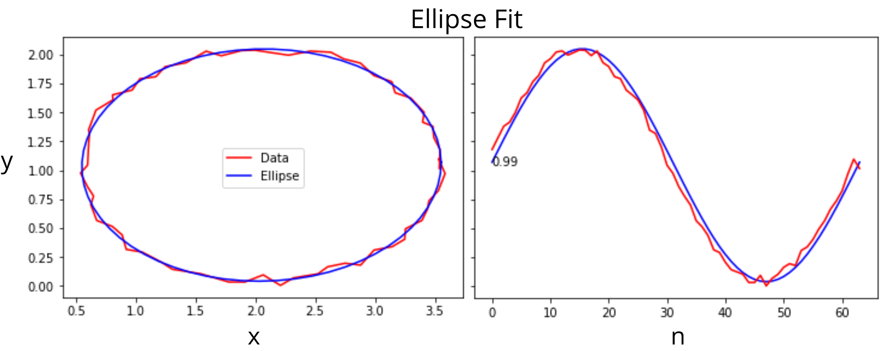

   Example of ellipse fitting test. Red line corresponds to a noisy ellipse,
   while the blue line is the optimal ellipse fitted. The left panel overlays
   the noisy ellipse and the fitted ellipse. The right panel shows the fitting
   in one dimension and the error between both curves.

Coefficients of determination around :math:`1` represent an exact
fit and the minimum value by default is :math:`0.85`.

The function argument to define minimum value of the ellipse fitness should be::

  preferences={'ellipse':0.85,'eccentricity':None,'gaussian':None}

if the preference argument is not defined their values will be replaced
by the default values::

    preferences={'ellipse':0.85,'eccentricity':0.85,'gaussian':0.8}

Eccentricity
""""""""""""

Closed contours and their corresponding ellipse could represent
coherent and/or elongated features. While the coherent structures with similar
ratios on their width and length are associated with
eddy like features, the elongated features may correspond to jets. Therefore,
to differentiate between these two processes
a condition of eccentricity is imposed over the fitted ellipse. The eccentricity
(:math:`\epsilon`) of an ellipse is defined as:

.. math::
   e = \left(1-\frac{b^2}{a^2}\right)^\frac{1}{2}

where :math:`a` is the length of the ellipse semi-major axis and :math:`b` the
length of the ellipse semi-minor axis (:numref:`eccent`).
The eccentricity of an ellipse is strictly less than 1. TrackEddy does
not differentiate between circles and ellipses; thus, the eccentricity of a
potential eddy is greater than or equal to 0 and smaller than the user
defined parameter.

The default user parameter constraints the eccentricity to
0.85. This value represents a ratio of :math:`\sim 2` between the semi-minor
axis and the semi-major axis (:math:`a\sim 2b`).
If this ratio between the minor axis :math:`b` and the major axis :math:`a`
is smaller to :math:`\sim 2` then the eddy is identified
(i.e :math:`a \lesssim 2b`). Otherwise, the closed contour and fitted ellipse
are discarded.

.. _eccent:
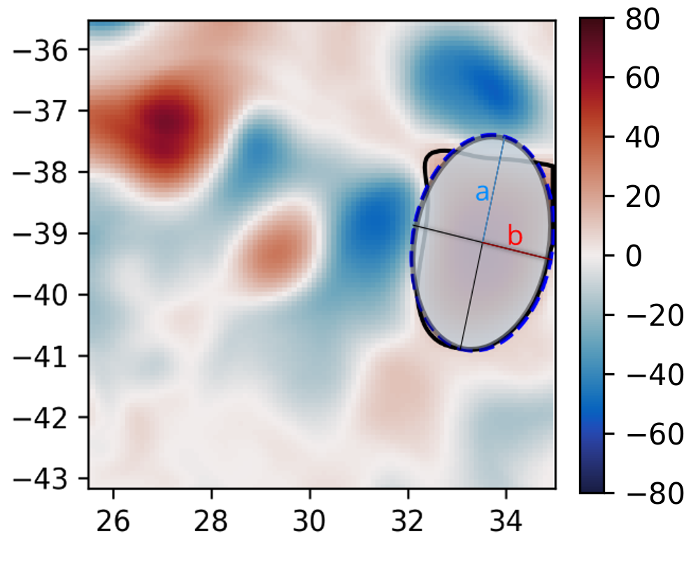

   Potential eddy like closed contour (black line), and its corresponding
   fitted ellipse (blue line) with minor axis :math:`b` and
   major axis :math:`a`.

The function argument to define ellipse eccentricity should be::

  preferences={'ellipse':None,'eccentricity':0.85,'gaussian':None}

if the preference argument is not defined their values will be replaced
by the default values::

  preferences={'ellipse':0.85,'eccentricity':0.85,'gaussian':0.8}

Area Check
""""""""""

Once Trackeddy fits and evaluates the eccentricity of the optimal ellipse, a
scale check is implemented. By default TrackEddy is intended to diagnose
mesoscale processes (10 km to 100 km) through scaling the first baroclinic
Rossby radius. However, the scaling can be defined by the user as
a constant value or by a netCDF file that specifies a scaling factor.

Mesoscale (Default)
'''''''''''''''''''
Mesoscale is referred to ocean signals with space scales of 10-100 km and
time scales of 10-100 days. To identify only mesoscale eddies, the area of each
individual eddy should be smaller than area of a circle with radius equal to the
first baroclinic Rossby radius (:math:`L_D`). Klocker, A. (2014) proposed
that the eddy length scale (:math:`L_{eddy}`) is:

.. math::
   L_{eddy} = 2\pi L_D

where :math:`(2\pi)^2` is the scaling factor of oceanic mesoscale features.

The eddy area (:math:`A_{eddy}`) is evaluated for both the closed contour and
the fitted ellipse. The contour area is defined as a box with a width of the
maximum distance in latitude and length of the maximum distance in longitude.
And the ellipse area is defined as two semi-minor axis times two semi-major
axis.

To satisfy the condition of mesoscale the area of the closed contour and the
ellipse should be less or equal to the area of a square with side
:math:`L_{eddy}`.

.. math::
  A_{eddy} = \left(2\pi \frac{(g'D)^\frac{1}{2}}{f}\right)^2 =
  \left(2\pi L_D \right)^2

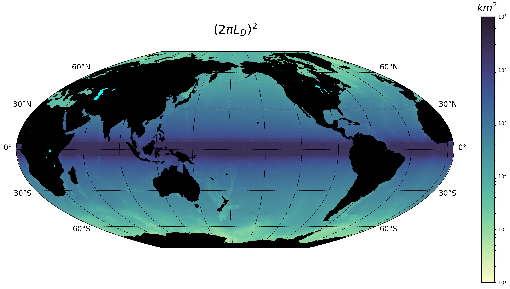

 Global eddy area based on the first baroclinic Rossby radius
 of deformation.

.. note::
 The Rossby Radius was obtained from the
 Global Atlas of the First-Baroclinic Rossby Radius of Deformation (`Click here
 <http://www-po.coas.oregonstate.edu/research/po/research
 /rossby_radius/index.html>`_). Where values were inexistent, they were
 replaced by the closest known value (:numref:`rossbyradius`).

  .. _rossbyradius:
  .. figure:: ../images/Rossby_radius_deformation.png
   :align: center
   :scale: 50 %
   :alt: Global First-Baroclinic Rossby Radius of Deformation

   Global First-Baroclinic Rossby Radius of Deformation.
..

.. attention::
 The decision to calculate areas using boxes instead of polygons reduced the
 computational time significantly.
..

This option is selected by default. To change the default factor to 0.5, the
argument should be::

  area={'mesoscale':0.5}

netCDF
''''''

The netCDF file should contain a field with a variable threshold. If the netCDF
variable is in a different grid, the closest value to the eddy location will
be used as the threshold. The factor argument corresponds to a unit scaling.
The argument to the TrackEddy function should be::

  area={'field':{path:'/path/to/netCDF','factor':1}}

TrackEddy will find the closest coordinate to the analyse eddy and compare it
against the eddy or feature area.

Constant
''''''''
To select a constant area threshold the argument to the TrackEddy function
should be::

  area={'constant':100} # Constant units same as x and y axis units

To remove the area check, the constant can be defined as :code:`np.inf`
or :code:`None`. For example::

  area={'constant':np.inf}

.. attention::
  The constant will have the same units as the coordinates.
  For example if the coordinates x, y are defined as longitude and latitude,
  the constant units will be degrees.
..

Gaussian Axis Check
"""""""""""""""""""

The next check is to analyse the field profile over the semi-minor
axis and semi-major axis of the ellipse. According to the detected eddies from
the Aviso+ satellite dataset (n=500) their profile along the ellipse minor and
major axis can be well represented by a Gaussian and/or parabola
(:math:`R^2 > 0.9`), however, the best approximation to the profile
average was the Gaussian fit (:numref:`gauss_fit`).

.. _gauss_fit:
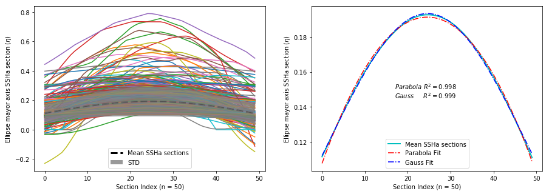

   Gaussian and parabolic fit over the average of 500 eddies.

Additionally, according to diffusion and advection, we will expect a
decay (Gaussian) instead of a step to zero (Parabolic). Therefore, to
identify an eddy, the data profile of the semi-minor and semi-major ellipse
axis should have a high coefficient of determination (:math:`R_\kappa^2`) with
its optimal fitted Gaussian:

.. math::
  R_\kappa^2 =1 - \frac{SSR}{TSS}
..

By default eddies are finally identified, if the fitness of their semi-minor
and semi-major axis is within the interval:

.. math::
   0.80 < R_\kappa^2 \leq 1

.. where :math:`\kappa` is the profile coefficient of determination.

Values around :math:`1` represent an exact fit and the minimum value
accepted should be higher than :math:`0.8`.

The function argument to define the minimum coefficient of determination should
be::

  preferences={'ellipse':None,'eccentricity':None,'gaussian':0.8}

if the preference argument is not defined their values will be replaced
by the default values::

  preferences={'ellipse':0.85,'eccentricity':0.85,'gaussian':0.8}

.. note::
  After all the previous described criteria, :numref:`contours_identif`
  show all identified eddies and their correspondent contour.

  .. _contours_identif:
  .. figure:: ../images/contours_all.png
    :align: center
    :scale: 50 %
    :alt:

    Identified eddies after implementing all the previous presented criteria.

..

Gaussian Fit (Optional)
"""""""""""""""""""""""

Finally, TrackEddy has the potential to reconstruct the field by fitting an
optimised 2D Gaussian to each identified eddy. To ensure the
representativity of the field, the fit of each 2D Gaussian is tested
by comparing the absolute difference between the integrals of the original
and the optimal fitted field. For the identification of each eddy, the
variation between the fields should be within 10 percent of its original value.

- Gaussian integral (G):

  .. math::
    G =  \sum_{i=0}^{i=N}\sum_{j=0}^{j=M}G_{cc}(i,j)
  ..

  where :math:`G_{cc}(i,j)` corresponds to the Gaussian data inside the close
  contour and :math:`(i,j)` are the indexes of the grid inside the contour.

- Original field integral (O):

  .. math::
    O =  \sum_{i=0}^{i=N}\sum_{j=0}^{j=M}O_{cc}(i,j)
  ..

  where :math:`O_{cc}(i,j)` corresponds to the original data inside the close
  contour.

- The interval accepted is:

.. math::
  0.9G \leq O \leq 1.1G
..

Additionally, the 2D Gaussian fitted must satisfy the same criteria as the eddy
identification, otherwise the eddy is discarded.

Once all the eddies in the field are identified, TrackEddy can reconstruct
the synthetic field as shown in :numref:`2dgauss`.

.. _2dgauss:
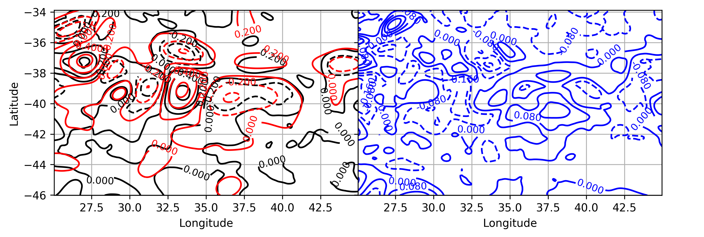

   Gaussian fitting. Left panel shows the original field (black line)
   underlying the reconstructed field (red line). Right panel shows the
   difference between fields.

Eddy Replacement
----------------

The Eddy Contour Replacement algorithm is responsible to add and replace
eddies at different z levels and determine the polarity of eddies.

Contour Replacement
"""""""""""""""""""

After TrackEddy identifies eddies in the first two levels, the eddies at
level :math:`E_{l_{n-1}}` are correlated with the eddies at level :math:`E_{l_n}`. If
and only if the eddy share their the same extreme value and the local
coordinates to the extreme value at both levels, then the eddy is replaced.
If the eddy at level :math:`E_{l_n}` do not share the maximum value with any
of the previous levels, then the eddy is added to the eddy dictionary.
This process is repeated until all the user defined levels are analysed
(:numref:`trackflow`).

If the 2D Gaussian fit is implemented then TrackEddy only replace the eddy
at level :math:`l(n)` if the Gaussian fit is better at this level. Otherwise,
it conserves the best fit to the field (:numref:`satextraction`).

.. _satextraction:
.. figure:: ../images/satellite_extraction.png
   :align: center
   :scale: 50 %
   :alt: Satellite extraction.

   Gaussian fitting in two dimensions to recreate the eddy field.
   (A) Anti-cyclonic eddy. (B) Cyclonic eddy. (C) Synthetic eddy field.
   (D) Difference between the original field and the synthetic fields [cm].

Eddy Time Tracking
------------------
All the transient features are identified in each SLA snapshot, following the
eddy identification algorithm, a time tracking is applied: For each eddy feature
identified at time :math:`t`, the features at time :math:`t+1` are searched to
find an eddy feature inside the closed contour or the closest feature within the
distance an eddy can displace between two successive time frames. This constrain
uses the phase speed of a baroclinic Rossby wave, calculated from the Rossby
radius of deformation as presented in Chelton *et. al.* [4] and a 180 degree
window search using the last preferential direction where the eddy was
propagating.

Once a feature at time :math:`t` is associated with another feature at time
:math:`t+1` their amplitude and area is compared. However, this comparison
doesn't avoid the association of eddies cause the nature and purpose of this
tracking algorithm.

When global model data is used, the eddies continuity on time is not
significative affected, therefore the eddies do not disappear as often as in
satellite data (AVISO products). Nonetheless, this tracking algorithm contain
an automatic procedure, which allows feature to be associated using an
user-defined number of time-steps as threshold before terminating the track
(This is also related with the traveled distance by the eddy).

.. attention::
  Future implementations will include a parameter relaxation to find missing
  eddies due to field fluctuations.
..

Output Data
-----------

Future Methods
--------------

Identification
""""""""""""""

.. note::
   - The phase angle will be implemented in the Beta 0.2 release [5].
   - The eddy's 3D structure will be implemented in the V.1 release.
..

Time
""""

.. note::
   The 180 degree window and closest feature within the baroclinic Rossby wave
   speed will be implemented for the next release.
..

.. .. figure:: ../images/how_it_works_area.png
..   :align: center
..   :scale: 50 %
..   :alt: Alt content

..   Section of the Aghulas current used to explain how the algorithm
   works.

Output
""""""

Currently all the output is handled as python
dictionaries, but in future versions it will have options to output netCDF4
format.
