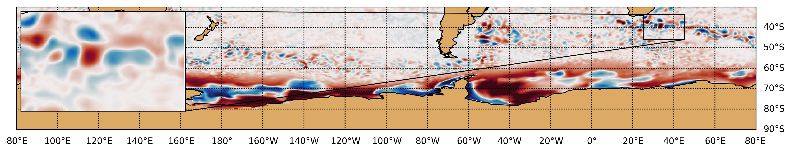

=======
Methods
=======

Structure

1.
Read in ssh
     - remove anomaly
     - detrend
     - Filter

One point for each flow chart

#################
Hello Merve, after we interviewed the other person, and the only reason why I decided to sublet my room to her, is the time fits better to her in terms that she is looking for 3 months. However, Olaide and myself were impressed by your application so you are welcome to come to the COOP whenever you want (You can also do some couch surfing in case you need). Additionally, If you need some help once you arrive in Canberra, I will like to help you to explore the university, the school and any other thing you may need. Also, I wanted to apologise, because I thought I said something rude during our interview without meaning it, when I referred to vulnerability, what I really meant was who may find it harder to get accommodation.

This algorithm was developed with the main idea of decomposing oceanic Kinetic
Energy into processes. Even when its implementation can be useful in multiple
applications, the current version of the algorithm is primarily focused on
methods to extract energy from SSH fields. However, according to few tests,
it could be implemented to track eddies in pressure levels, isopycnals and even
vorticity.

The criteria ranges were defined using a repetitive Southern Ocean simulation,
particularly this section of the documentation was done analysing a section of
the Aghulas current. For a detailed - code description, refer to `how_it_works.ipynb
<https://github.com/Josue-Martinez-Moreno/trackeddy/blob/fitting_bug_fixing/
examples/how_it_works.ipynb>`_

   Figure 1. Section of the Aghulas current used to explain how the algorithm
   works.

Eddy Identification Criteria
----------------------------

.. It's necessary to point out that cyclonic eddies are surrounded by a negative
.. closed-contour SLA, while anticyclonic eddies are surrounded by a positive
.. closed-contour SLA. Both polarities possess a specific phase angle between the
.. velocity components.

.. To determine the outermost contour of the eddy, starting from a extreme value
.. (i.e. 200 cm or 2 m, depending on the dataset units), the algorithm searches
.. for the largest possible contour that would allow the feature to not violate
.. the assumption that an eddy has an ellipse shape and a Gaussian fitting inside
.. the closed contour. In the final version of the algorithm will be possible to
.. reconstruct the eddy's 3D structure. Currently, the algorithm allows to
.. reconstruct the surface of the eddy using a 2D Gaussian fitting, which allows
.. the remotion of the background signal.

.. Figure 1 shows how the algorithm works for an idealised Gaussian. The algorithm
.. separates cyclonic and anticyclonic eddies, in fact, it's possible to analyse
.. only cyclonic or anticyclonic eddies. For a given extreme contour value,
.. starting at that SLA value, a threshold value is gradually increased in the
.. contour level (Default value = 1 cm), however, Faghmous, J. *et. al.* showed
.. that a finer threshold step leads to more accurate eddy sizes and amplitudes[4].
.. This threshold step size does affect the algorithm's wall time, however, the
.. algorithm is really parallelizable. This allows to use fine threshold steps
.. with reasonable compute time for a global dataset.

TrackEddy identifies eddies when their outer most contours can be fitted
by an ellipse (`A. Fernandes and S. Nascimento,
(2006) <https://link.springer.com/chapter/10.1007%2F11893318_11>`_),
the area of the eddy contour is smaller than :math:`2 \pi L_r`
(`Klocker, A., & Abernathey, R. (2014) <https://journals.ametsoc.org/doi/abs/10.1175/JPO-D-13-0159.1>`_),
the eccentricity of the fitted ellipse is smaller than :math:`\frac{b}{2a}` and
the field profile along the minor and major axis of the fitted ellipse must
adjust to a Gaussian. Optionally, an additional criterion is implemented when
the 2D Gaussian fitting is allowed, this criterion identifies eddies only if the
fitted 2D Gaussian correlates over 90%. For additional information, please
refer to the following subsections.

These criteria allows eddies to contain multiple local extreme values, which is
particularly beneficial when they merge, interact or form from jets or other
processes.

Ellipse Fitting
"""""""""""""""

According with Fernandes (2006) an eddy can be represent as an ellipse. Therefore,
in this algorithm the optimal ellipse is fitted to any close contour and in
order to determine if it corresponds to an eddy, the correlation between the
fitted ellipse and the close contour should be within the interval (:math:`e`) :

.. math::
   0.85 < e \leq 1

.. figure:: ../images/contours_ellipse.png
   :align: center
   :scale: 30 %
   :alt: Alt content

   Figure 2. Identified contours only within the ellipse fitting interval
   (Ignoring any additional criteria).

Values around :math:`1` represent an exact fitness and the minimum value
accepted should be higher than :math:`0.85`.

.. .. figure:: ../images/algorithm_work_FV.png
..   :scale: 50 %
..   :alt: Ellipse criteria for eddy identification in the trackeddy algorithm
..
..   Figure 2. First step where eddies are discarded when the ellipse fitness is
..   less than 0.65  (Blue-dotted line shows the Ellipse fitted and the red
..   line shows the closed contour). The data correspond to a numerical simulation
..   of the Southern Ocean.

Area Check
""""""""""
The eddy area (:math:`A_{eddy}`) was defined as a box with sides
of two semi-minor axis and two semi-major axis of the fitted ellipse.
Klocker, A. (2014) proposed that the eddy length scale (:math:`L_{eddy}`) is
always smaller than two :math:`\pi` Rossby Radius.

Therefore, the area of any identified eddy should be less or equal to a square
with sides two times the Rossby Radius.

.. math::
   A_{eddy} \leq \left(2\pi \frac{(g'D)^\frac{1}{2}}{f}\right)^2 =
   \left(2\pi Lr \right)^2

.. figure:: ../images/Area_rossby_radius_deformation.png
   :scale: 30 %
   :alt: Eddy area based on the First-Baroclinic Rossby Radius of Deformation.

   Figure 3. Global eddy area based on the First-Baroclinic Rossby Radius
   of Deformation.

.. note::
  The Rossby Radius was obtained from the
  Global Atlas of the First-Baroclinic Rossby Radius of Deformation (`Click here
  <http://www-po.coas.oregonstate.edu/research/po/research
  /rossby_radius/index.html>`_). Where values were inexistent, they were
  replaced by the closest known value (Fig. 3).

  .. figure:: ../images/Rossby_radius_deformation.png
     :align: center
     :scale: 10 %
     :alt: Global First-Baroclinic Rossby Radius of Deformation

     Figure 4. Global First-Baroclinic Rossby Radius of Deformation.

..

.. attention::
  The decision to calculate areas using boxes instead of polygons reduced the
  computational time significantly.
..

Eccentricity
""""""""""""

In order to remove elongated features, potentially jets and because eddies are
stable coherent structures a condition of eccentricity was imposed.
The ellipse eccentricity (:math:`\epsilon`) range goes from :math:`0`
(perfect circle) to 1 (line). Thus the selected value to constrain it represents
a semi-minor axis two times smaller than the semi-major axis (:math:`a=2b`) or:

.. math::
   \epsilon = \left(1-\frac{b^2}{a^2}\right)^\frac{1}{2} \ if \ a<=2b
   \rightarrow Eddy\ is\ identified

or

.. math::
   0 \leq \epsilon \leq 0.85

.. figure:: ../images/eccent.png
   :align: center
   :scale: 30 %
   :alt:

   Figure 5. Eddy characterisation based on the eccentricity of the
   fitted ellipse (blue line).

Gaussian Axis Check
"""""""""""""""""""

According with 500 detected eddies (Fig. 5), their mean profile can be fitted by
a Gaussians and/or paraboloids, however the best fit was found on the Gaussian
fit. Additionally, according with diffusion and advection we will expect a decay
(Gaussian) instead of an abrupt change (Parabolic). Therefore, to identify an
eddy, the data profile of the minor and major axis should have a high
coefficient of determination (:math:`\psi`) with its optimal fitted gaussian.
The interval was define as:

.. math::
   0.80 < \psi \leq 1

Values around :math:`1` represent a exact fitness and the minimum value accepted
should be higher than :math:`0.8`.

.. figure:: ../images/gaussian_fitness.png
   :scale: 30 %
   :alt: Gaussian shape in the ellipse's axis for more than 500 eddies.

   Figure 6. Gaussian and parabolic fit over the average of 500 eddies.

.. warning::
  This criterion potentially will be removed in further versions of the
  algorithm due to it's minimal impact over the detected eddies.
..

.. note::
  After all the previous described criteria the Figure 6 show all identified
  eddies and their correspondent contour.

  .. figure:: ../images/contours_all.png
    :align: center
    :scale: 30 %
    :alt:

    Figure 7. Identified contours using all criteria.

..

2D Gaussian (Optional)
""""""""""""""""""""""

The fitness of a 2D Gaussian is constrain by the coefficient of determination
between the integral of the original field and the fitted field. Additionally,
the 2D gaussian fitted must satisfy the same criteria as the eddy identification,
otherwise the eddy is discarded.

  + Fitted contour area should be within:

  .. math::
     \frac{A_{contour}}{1.05} \leq A_{2D\ Gaussian} \leq 1.05A_{contour}

  + 2D gaussian eccentricity should be on range:

  .. math::
     0 \leq e < 0.95

.. figure:: ../images/2dgauss_fit.png
   :scale: 30 %
   :alt: 2D Gaussian fitting.

   Figure 8. Gaussian fitting. Left panel shows the original field (black line)
   underlying the reconstructed field (red line). Right panel shows the
   difference between fields.

.. important::
    If this option is allowed, the condition to identify eddies depends on the
    fitness of the fitted Gaussian. Which should be within the interval
    :math:`0.90 < e_G \leq 1`. Otherwise, the eddy is discarded.
..

.. This allows to extract and reconstruct with indirect methods the eddy field.
.. No other parameter are imposed so just the eddies without this gaussian and ellipse features are
.. discarded.

Eddy Contour Replacement
------------------------
The algorithm correlates vertical contours whenever the level :math:`l(n-1)`
share their local maxima value and the local coordinates of the maxima
with the current analysed level :math:`l(n)`. This process is only allowed
when the contour with level :math:`l(n)` passes all the Eddy Identification
Criteria

According with the criteria described before, the current algorithm is capable
of extracting the eddy signal from Aviso's dataset.

.. figure:: ../images/satellite_extraction.png
   :scale: 30 %
   :alt: Satellite extraction.

   Figure 5. Gaussian fitting in two dimensions to recreate the eddy field.
   (A) Anti-cyclonic eddy. (B) Cyclonic eddy. (C) Synthetic eddy field.
   (D) Difference between the original field and the synthetic field [cm].

Eddy Time Tracking
------------------
All the transient features are identified in each SLA snapshot, following the
eddy identification algorithm, a time tracking is applied: For each eddy feature
identified at time :math:`t`, the features at time :math:`t+1` are searched to
find an eddy feature inside the close contour or the closest feature within the
distance an eddy can displace between two sucessive time frames. This constrain
uses the phase speed of a baroclinic Rossby wave, calculated from the Rossby
radius of deformation as presented in Celton *et. al.* [4] and a 180 degree
window search using the last peferential direction where the eddy was
propagating.

Once a feature at time :math:`t` is associated with another feature at time
:math:`t+1` their amplitude and area is compared. However, this comparison
doesn't avoid the association of eddies cause the nature and purpose of this
tracking algorithm.

When global model data is used, the eddies continuity on time is not
significative affected, therefore the eddies do not disappear as often as in
satellite data (AVISO products). Nonetheless, this tracking algorithm contain
an automatic procedure, which allows feature to be reassociated using an
user-defined number of time-steps as threshold before terminating the track
(This is also related with the traveled distance by the eddy).

Future Methods
--------------

Identification
""""""""""""""

.. note::
   - The phase angle will be implemented in the Beta 0.2 release [5].
   - The eddy's 3D structure will be implemented in the V.1 release.
..

Time
""""

.. note::
   The 180 degree window and closest feature within the baroclinic Rossby wave
   speed will be implemented for the next release.
..
